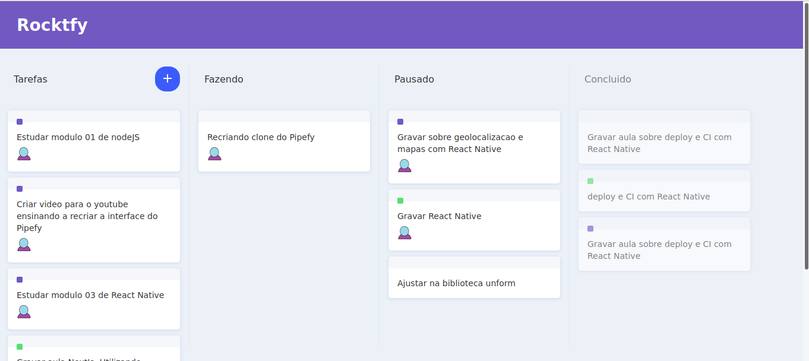

Projeto: RocketFy

Um clone do [Pipefy](https://www.pipefy.com/pt-br/) usando drag 'n drop em reactjs.

### Utilidade:

- Aplicação usada como aprendizado do ReactJs.

#### Material:

- ReactJS
- React-router-dom
- Styled-components

#### Modo de uso:

1. Abra um terminal ( cmd/propt de comando )
2. Clone o repositório ( git clone git@github.com:RobMota/rocketfy.git ) em algum local de preferência
3. Acesse a pasta ( cd rocketfy )
4. E digite os comandos abaixo:

- npm / yarn install
- npm / yarn start

#### Autor do projeto original:

- [Diego Fernandes](https://github.com/diego3g)
